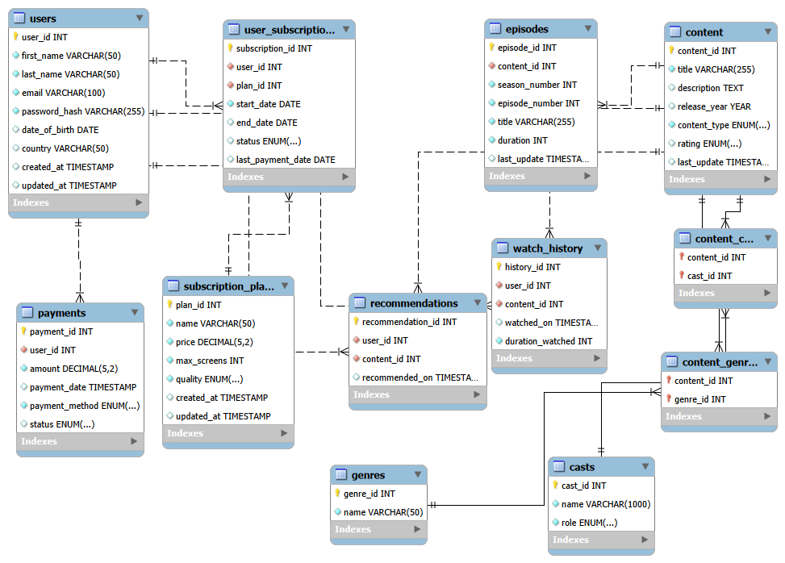

🎬 SQL Streaming Analytics: Behavioral Case Study
📌 Project Overview
This repository contains a 20-query deep dive into the relational database logic of a fictional streaming platform. The project moves beyond basic CRUD operations to solve complex business problems, such as auditing recommendation engines, tracking subscription lifecycle, and calculating relative payment benchmarks.

🧠 Key Technical Concepts
Correlated Subqueries: Implementing row-by-row "handshakes" to track time-sensitive user actions (e.g., verifying if a watch happened after a recommendation).

Double Aggregation: Calculating global averages of user totals to identify "above-average" spenders.

The "Only" Constraint: Using mathematical count-matching to isolate users who follow specific behavior patterns with 100% adherence.

🛠️ Featured Logic: The "Perfect Follower" Audit
The Challenge: Retrieve users who have only watched content that was recommended to them.

The Solution: Instead of a simple join, I utilized a Balance Scale approach. By comparing the total count of a user's history against the count of their verified recommendations, the query ensures no "manual" views exist in their profile.

SQL
SELECT wh1.user_id
FROM watch_history wh1
GROUP BY wh1.user_id
HAVING COUNT(content_id) = (
    -- THE ASSISTANT: Counts matches in the recommendations table
    SELECT COUNT(rs.content_id)
    FROM recommendations rs
    WHERE rs.user_id = wh1.user_id 
      AND rs.content_id IN (
          SELECT content_id FROM watch_history wh2 
          WHERE wh2.user_id = wh1.user_id
      )
);
📂 Repository Structure
schema.sql: Defines the database architecture (Users, Content, Payments, Subscriptions).

data.sql: Sample data to demonstrate the "Pass/Fail" mechanics of complex queries.

assignment_queries.sql: The full set of 20 analytical queries with detailed comments.

📜 License
This project is licensed under the MIT License. Feel free to use the logic and patterns for your own learning or projects.
